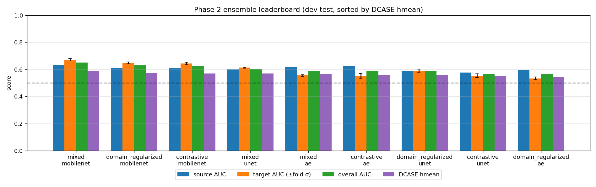
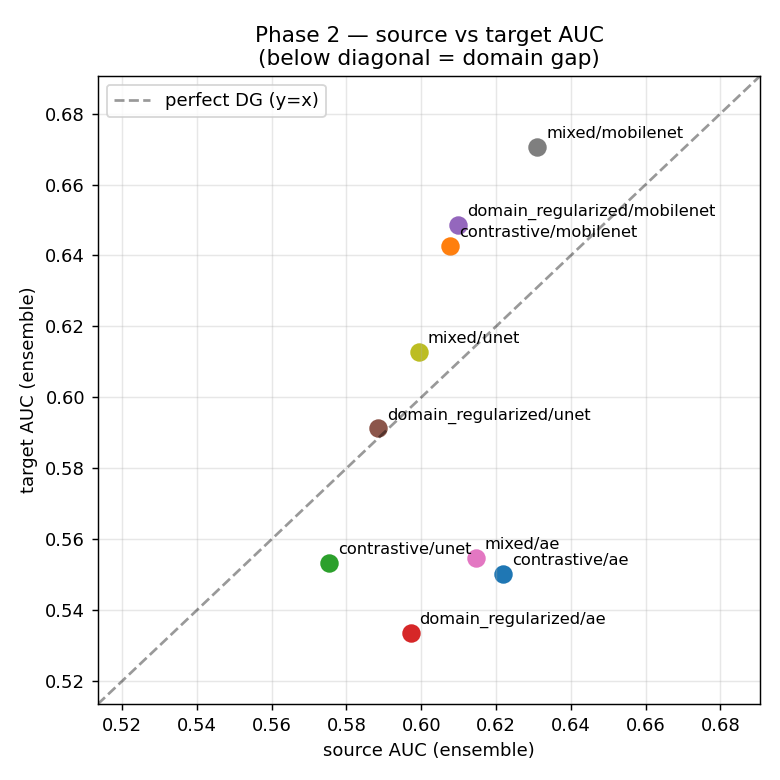
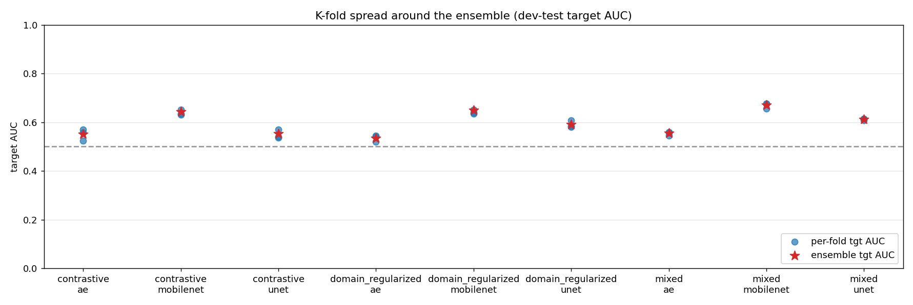
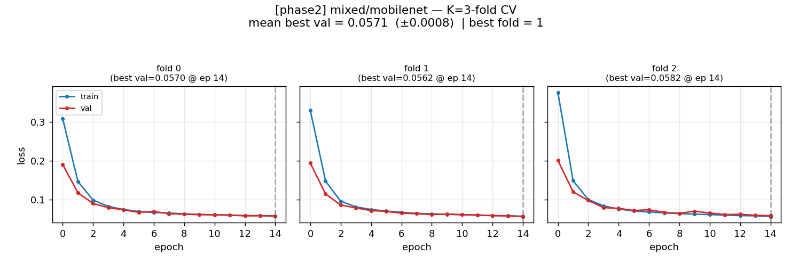
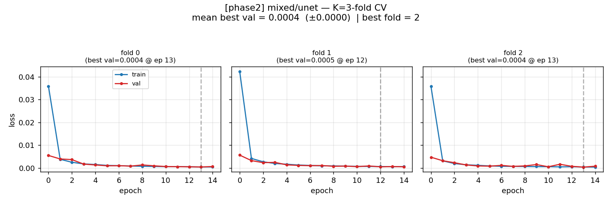

# Final Phase Report (Consolidated)
_Updated for discussion-ready storytelling_

## 1) Problem statement and dataset context

This work addresses **unsupervised anomalous sound detection (ASD)** for machine condition monitoring with a **domain generalization** constraint (DCASE 2022 Task 2 style):

- training mostly on normal sounds,
- handling source/target domain shift,
- applying one threshold even when test-domain identity is unknown.

Reference: [DCASE 2022 Task 2](https://dcase.community/challenge2022/task-unsupervised-anomalous-sound-detection-for-machine-condition-monitoring#dataset-overview)

### Source vs target and imbalance

- Source domain is the dominant operating condition.
- Target domain is a shifted condition (speed/load/noise/mic/etc.).
- Per-section design is highly imbalanced (about 990 source normal vs 10 target normal).
- In this bearing pipeline logs, combined pool is approximately 5940 source vs 59 target.

Implication: target robustness and fold variance are critical metrics, not only source fit.

## 2) Dataset structure used in this project

For bearing:

- train roots: dev-train sections `00-02` + eval/additional-train sections `03-05`
- labeled validation/evaluation for model selection: dev-test sections `00-02`
- unlabeled final scoring split: eval-test sections `03-05`

Filename patterns:

- labeled style includes domain/label tokens
- eval-test style is stripped (`section_03_0000.wav`) with hidden domain/label

## 3) Architectures and parameter counts

From `model.py`:

| Architecture key | Class | Params |
|---|---|---:|
| `ae` | `SimpleAE` | 6,929 |
| `unet` | `UNetAE` | 467,233 |
| `mobilenet` | `MobileNetAE` | 682,385 |
| `unet_mobilenet_encoder` | `UNetMobileNetEncoderAE` | 703,601 |

Input to all models: `(B, 1, H, W)` log-mel.  
Output: `(recon, z)`, with anomaly score as reconstruction MSE.

## 4) Training modes and loss definitions

Modes in `train_lean.py`:

- `baseline`: source-only, reconstruction MSE
- `mixed`: source+target mixed batches, reconstruction MSE
- `domain_regularized`: reconstruction MSE + 0.1 * domain CE loss
- `contrastive`: reconstruction MSE + 0.1 * contrastive term

K-fold protocol:

- stratified split by `(section, domain)` with `K=3` in this run,
- best epoch selected by fold val loss,
- inference uses K-fold score averaging (ensemble).

### Interpreting fold/batch composition logs

Example training logs:

- `val: 1980 source + 21 target = 2001 clips (both drawn from both roots, all normal)`
- `train=3998 (src=3960, tgt=38)  val=2001`
- `[batch-check] first batch: 51 source + 13 target = 64 (target share = 20%)`

Explanation:

- Validation fold still reflects natural imbalance (source dominates target).
- Training fold is similarly imbalanced at dataset level.
- But the sampler intentionally enforces higher target ratio in minibatches (`~20%`) so optimization is not fully source-dominated.
- This balancing is crucial for domain generalization since raw target coverage is tiny.

### Why this imbalance is a real optimization problem

In this run, combined bearing training data is approximately:

- source = 5940
- target = 59

So raw target share is about 1%. With plain random batching, gradients are almost entirely source-driven and the model may overfit source-domain reconstruction patterns.

### How the pipeline addresses it

1. **Stratified K-fold split (K=3, by section and domain)**  
   Source and target are split separately and then combined per fold. This ensures every fold's train/val subsets contain both domains and broad section coverage.

2. **BalancedDomainSampler in training batches**  
   Even though fold-level dataset counts remain imbalanced, mini-batches are rebalanced toward target (`target_ratio=0.2`).  
   Example first batch log: `51 source + 13 target = 64` (20% target), far above raw ~1% target prevalence.

3. **Mode/loss terms run on these balanced batches**  
   `mixed`, `domain_regularized`, and `contrastive` all benefit from seeing consistent target exposure during optimization.

### What K=3 helps with (and what it does not)

- **Helps:** more stable model selection, less dependence on one split, validation always includes source+target clips, and ensemble averaging reduces variance.
- **Does not by itself solve imbalance:** it improves split fairness and reliability, but batch rebalancing is the primary mechanism that counteracts gradient dominance from source data.

## 5) Model comparison and winner selection

Total phase-2 runs evaluated: **9**.

Winner: **`mixed/mobilenet`**.

Selected by highest ensemble hmean, tie-broken by target AUC and lower fold target-AUC variance.

| metric | value |
|---|---|
| ensemble source AUC | 0.6311 |
| ensemble target AUC | 0.6707 |
| ensemble overall AUC | 0.6512 |
| ensemble DCASE hmean | 0.5904 |
| source AUC − target AUC | -0.0396 |
| per-fold target AUC σ | 0.0088 |
| K-fold mean best val loss | 0.0571 (±0.0008) |
| fold count | 3 |

### Winner vs trained UNet (`mixed_unet`)

| model | src AUC | tgt AUC | ovr AUC | hmean |
|---|---:|---:|---:|---:|
| `mixed_mobilenet` (winner) | 0.6311 | 0.6707 | 0.6512 | 0.5904 |
| `mixed_unet` | 0.5993 | 0.6127 | 0.6051 | 0.5690 |

Conclusion: winner is stronger than trained UNet on all major ranking metrics, especially target AUC.

## 6) Overfitting discussion (train vs val plots)

Where to inspect:

- `leaderboard.png`, `source_vs_target.png`, `kfold_variance.png`
- `checkpoints/<run>_kfold_overview.png`
- `checkpoints/<run>_fold*_history.png`
- `eval_results/<run>/ensemble/*.png`

Inline previews:







Observed pattern from history JSONs:

- `mixed_mobilenet`: train and val losses decrease together with small late oscillations; no major divergence.
- `mixed_unet`: very low reconstruction val loss but some late-epoch rebound; strong reconstruction fit does not translate to top anomaly ranking under domain shift.

## 7) Threshold calibration and confusion matrix

From `phase_final_outputs/threshold_metrics.json` (calibrated on labeled dev-test):

- threshold: **0.0543546490**
- precision: **0.5615**
- recall: **0.9433**
- f1: **0.7040**
- roc_auc: **0.6512**

Confusion matrix (dev-test):

- TN = 79
- FP = 221
- FN = 17
- TP = 283

Interpretation:

- Low FN and high recall mean anomalies are mostly caught.
- High FP indicates many false alarms; threshold can be shifted if precision is prioritized over recall.

## 8) Unlabeled eval-test output scope

For unlabeled eval-test (`predict_outputs/`):

- scored clips: 600 (sections 03/04/05)
- score files generated per section
- threshold in latest standalone test: `None` (scores only)

Important clarification:

- Source/target **domain labels** are not available in eval-test.
- If anomaly/normal **ground-truth labels** are available locally, confusion matrix can be computed for eval-test.
- For official DCASE evaluation data (where anomaly/normal labels are hidden), confusion matrix cannot be computed offline and is available only after official scoring.

## 9) Repro commands (core)

```bash
python prepare_cache_lean.py
python train_lean.py --mode <mode> --arch <arch> --n_folds 3
python evaluate_lean.py --mode <mode> --arch <arch>
python collect_results_lean.py --rank_by hmean
python predict.py --model_dir <results_phase_final> --input_dir <eval_test_dir> --out_dir <predict_outputs>
```